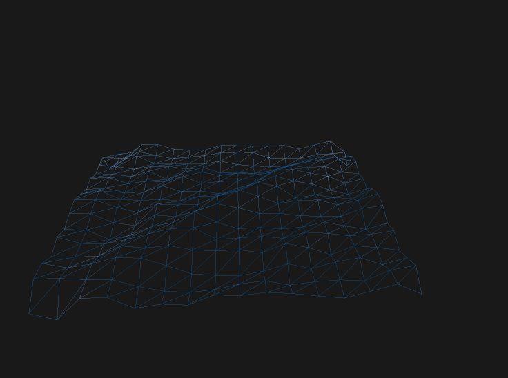

# OceanSimulator

## Dependencies

1. GLFW(Included in project)
2. [Freetype library](https://www.freetype.org/)

## Notes

Before running any executable, make sure the `shaders/`,  `textures/`, and `fonts/` folder is placed where the executable is.

## Some Results:

####Gerstner Wave Based Water Surface

.gif)

####DFT Implementation of the Statistic Ocean Wave Model

