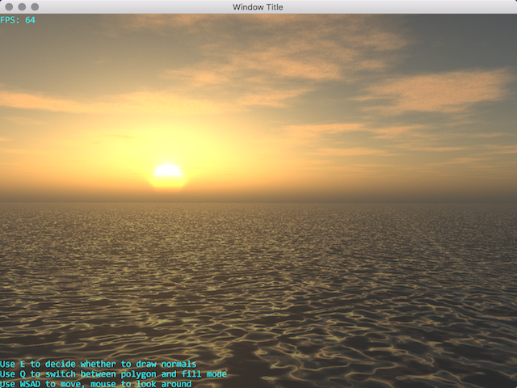
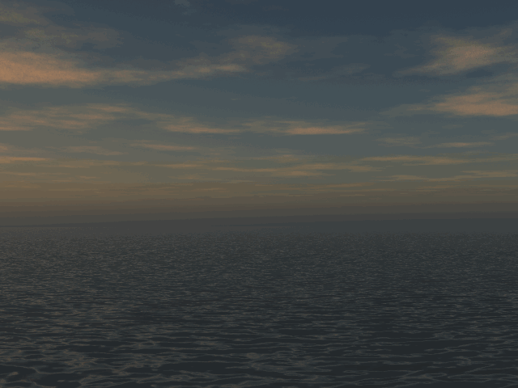

# OceanSimulator
This code repository contains my several experiments on water/ocean simluation.

For detailed information of how this is implemented, please see my blog.
1. http://www.cnblogs.com/hehao98/p/8544121.html
1. http://www.cnblogs.com/hehao98/p/8604163.html
1. http://www.cnblogs.com/hehao98/p/8709636.html

## Dependencies

1. GLFW(Included in project)
2. [Freetype library](https://www.freetype.org/)

## Notes

Before running any executable, make sure the `shaders/`,  `textures/`, and `fonts/` folder is placed where the executable is.

## Some Results:

